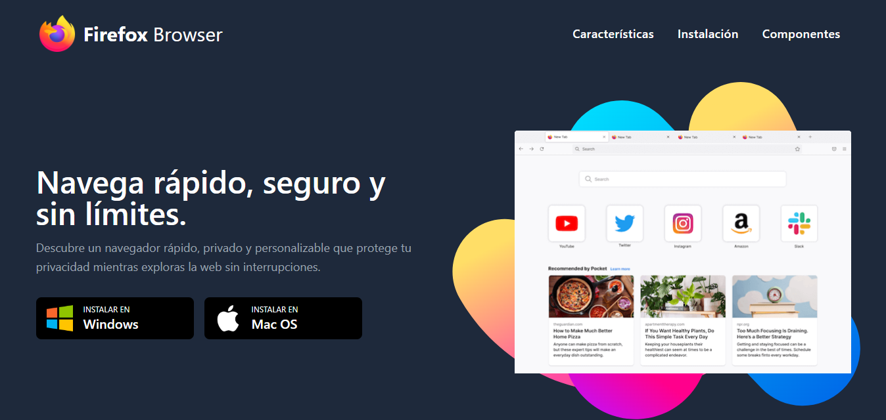

# 🔥 Firefox Clone - Web UI  

Este proyecto es una **simulación del sitio web de Firefox**, creada con **React**, **Vite**, **Tailwind CSS** y **Framer Motion**.  
El propósito principal fue **practicar la implementación de Tailwind CSS para el diseño responsivo**, React para la estructura de la UI y Framer Motion para añadir **animaciones atractivas** y mejorar la experiencia de usuario.  

🚀 **Live Demo**: [Enlace a la demo](https://firefox-beta-five.vercel.app/)

---

## 🛠 Tecnologías Utilizadas  

- ⚡ **React** – Estructura de componentes reutilizables.  
- 🚀 **Vite** – Entorno de desarrollo ultrarrápido y optimizado para React.  
- 🎨 **Tailwind CSS** – Diseño responsivo y estilización rápida con clases de utilidad.  
- ✨ **Framer Motion** – Animaciones fluidas y transiciones atractivas.  

---

## 🎯 Características  

✅ **Diseño Responsivo** – Adaptable a cualquier pantalla, desde móviles hasta monitores grandes.  
✅ **Animaciones Suaves** – Transiciones dinámicas que hacen que la navegación sea más atractiva.  
✅ **Layout Adaptable** – Secciones flexibles y bien organizadas para imitar la web original de Firefox.  
✅ **Código Modular** – Uso de componentes de React para una mejor organización y reutilización.  

---

## 📸 Vista Previa  



---

## 🚀 Instalación y Uso  

1️⃣ **Clona el repositorio**  
```bash
git clone https://github.com/Agustin2799/Firefox.git
cd firefox
```
2️⃣ **Instala las dependencias**
```bash
npm install
```
3️⃣ **Inicia el servidor de desarrollo**
```bash
npm run dev
```

---

## 💡 Aprendizajes Clave  

Este proyecto me permitió:  
✅ **Profundizar en el uso de Tailwind CSS** para estilización rápida y responsiva.  
✅ **Implementar Framer Motion** para mejorar la interactividad con animaciones.  
✅ **Estructurar una web con React** y componentes reutilizables.  

---

## 🧑‍💻 Autor  

Desarrollado por **[Agustín Alonso - FrontEnd developer](https://www.linkedin.com/in/agustin-alonso-p/)**.  

`Si te gusta este proyecto, ¡no olvides darle una ⭐ en GitHub!.`

## 📜 Licencia  

Este proyecto está bajo la **Licencia MIT**.  
